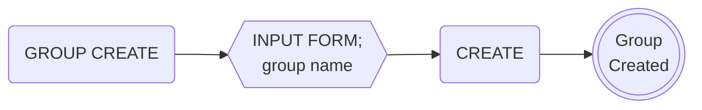

# 해야 할 일

To-do 앱의 모든 기능을 담고 있다.


## 로직

- A moderator should begin with creating a group to start managing tasks and users.



```mermaid
flowchart LR
  START(GROUP CREATE)
    --> FORM{{INPUT FORM;<br>group name}}
      --> SAVE(CREATE) --> END(((Group\nCreated)))
```

- Task can be created any member.

```mermaid

```
